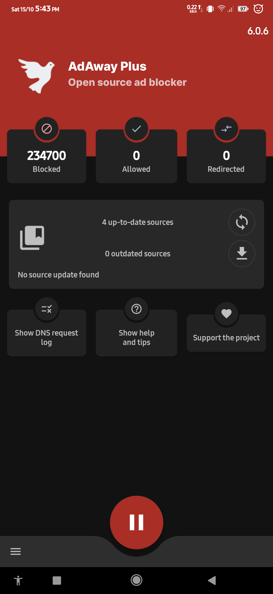

#  AdAway Plus

<!---

--->

AdAway Plus is an open source ad blocker for Android using the hosts file and local vpn.

For more information visit https://adaway.org

## Installing

**Requirements:**
* Android Android 5 _Lollipop_ (API 21) or above

After preview builds have been tested by the more technical or responsive community within the forums, we will then post the stable build to F-Droid.

<!---

--->

## Get Host File Sources

See the [Wiki](https://github.com/AdAway/AdAway/wiki), in particular the page [HostsSources](https://github.com/AdAway/AdAway/wiki/HostsSources) for an assorted list of sources you can use in AdAway.
Add the ones you like to the AdAway "Hosts sources" section.

## Getting Help

You can post [Issues](https://github.com/AwaisKing/AdAway-Plus/issues) here or obtain more detailed community support via the [XDA developer thread](http://forum.xda-developers.com/showthread.php?t=2190753).

## Contributing

You want to be involved in the project? Welcome onboard!  
Check [the contributing guide](CONTRIBUTING.md) to learn how to report bugs, suggest features and make you first code contribution :+1:

If you are looking for translating the application in your language, [the translating guide](TRANSLATING.md) is for you.

## Project Status

AdAway is actively developed by:
* Awais ([@AwaisKing](https://github.com/AwaisKing)) - Porting to Android 5+   
* Bruce Bujon ([@PerfectSlayer](https://github.com/PerfectSlayer)) - Developer  
<!---
[PayPal](https://paypal.me/BruceBUJON) | [GitHub Sponsorship](https://github.com/sponsors/PerfectSlayer)
--->
* Daniel Mönch ([@Vankog](https://github.com/Vankog)) - Translations
* Jawz101 ([@jawz101](https://github.com/jawz101)) - Hosts list
* Anxhelo Lushka ([@AnXh3L0](https://github.com/AnXh3L0)) - Web site

We do not forget the past maintainers:
* Dāvis Mošenkovs ([@DavisNT](https://github.com/DavisNT)) - Developer  
[Paypal](https://www.paypal.com/cgi-bin/webscr?cmd=_donations&business=5GUHNXYE58RZS&lc=US&item_name=AdAway%20Donation&no_note=0&no_shipping=1)
* [@0-kaladin](https://github.com/0-kaladin) - Developer and XDA OP
* Sanjay Govind ([@sanjay900](https://github.com/sanjay900)) - Developer

And we thanks a lot the original author:
* Dominik Schürmann ([@dschuermann](https://github.com/dschuermann)) - Original developer  
[Paypal](https://www.paypal.com/cgi-bin/webscr?cmd=_donations&business=android%40schuermann.eu&lc=US&item_name=AdAway%20Donation&no_note=0&no_shipping=1&currency_code=EUR) | [Flattr](https://flattr.com/thing/369138/AdAway-Ad-blocker-for-Android) | BTC: `173kZxbkKuvnF5fa5b7t21kqU5XfEvvwTs`

## Permissions

AdAway Plus requires the following permissions:

* `INTERNET` to download hosts files and application updates.
* `ACCESS_NETWORK_STATE` to restart VPN on network connection change
* `RECEIVE_BOOT_COMPLETED` to start the VPN on boot
* `FOREGROUND_SERVICE` to run the VPN service in foreground
* `REQUEST_INSTALL_PACKAGES` to update the application using the builtin updater
* `QUERY_ALL_PACKAGES` to let the user pick the applications to exclude from VPN

## Licenses

AdAway is licensed under the GPLv3+.  
The file LICENSE includes the full license text.
For more details, check [the license notes](LICENSE.md).
